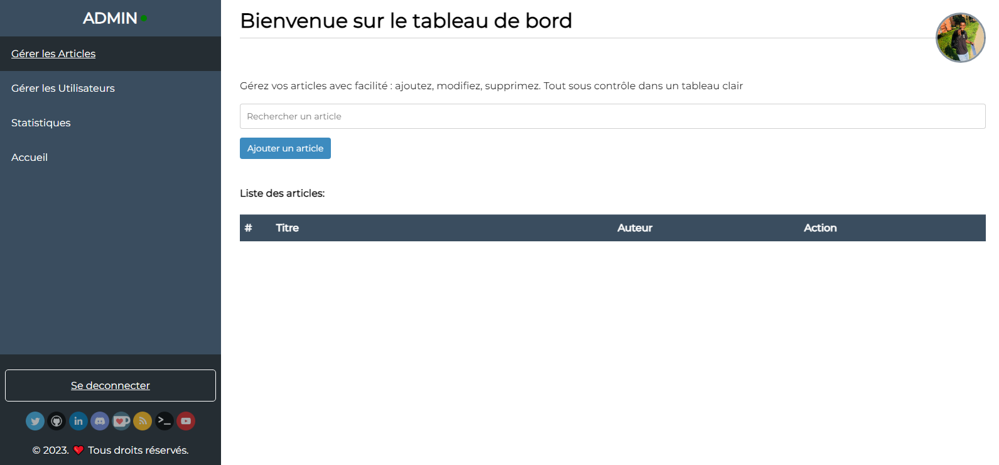

# Dash-Blog
Passionné par le back-end, j'aimerais  présenter mon projet personnel, "Dash-Blog".
Dash Blog, c'est avant tout une aventure personnelle dans le monde du développement web. Ici, vous ne trouverez pas de termes alambiqués ni de concepts complexes. Je suis encore un junior, tout comme beaucoup d'entre vous, et je partage ouvertement mes découvertes, mes erreurs et mes petits succès au fil de mon parcours.

L'interface d'administration:

### 🚀 À Propos de Dash-Blog
Dash-Blog n'est pas encore un blog complet, mais c'est mon terrain de jeu pour perfectionner mes compétences en back-end avec PHP. Il offre actuellement les fonctionnalités suivantes :

- **Consultation d'articles:** Les utilisateurs peuvent parcourir et lire les articles disponibles sur le blog.
- **Tableau de bord administratif:** Réservé aux administrateurs, cet espace permet d'ajouter ➕, de modifier ✏️, de supprimer 🗑️ et de rechercher 🔍 des articles.
- **Integration du WYSIWYG (What You See Is What You Get)**

### Technologies Utilisées
- HTML5: 🌐 Structure de base pour la présentation.
- CSS3: 🎨 Styles pour rendre l'expérience utilisateur agréable.
- PHP 8: 🐘 Le cœur du back-end, gérant la logique côté serveur.
- MySQL: 🛢️ Base de données pour stocker et organiser les données.

### À Venir
Bien que Dash-Blog soit actuellement un projet d'apprentissage, j'ai des plans pour le développer davantage. Des fonctionnalités plus avancées et des améliorations de l'interface utilisateur sont dans mes objectifs futurs.

### 👥 Contribuer
🤝 J'encourage toute contribution à Dash-Blog ! Si vous êtes intéressé(e), n'hésitez pas à cloner le projet, à proposer des améliorations ou à signaler des problèmes. Vos idées sont les bienvenues.

 @Ber1y
